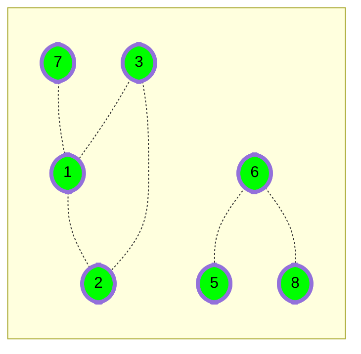

# [Roads and Libraries](https://www.hackerrank.com/challenges/torque-and-development)

Help the ruler of HackerLand determine the cheapest way to
give his citizens access to libraries.

- Difficulty:  `#medium`
- Category: `#ProblemSolvingAdvanced` `#graphs`

Determine the minimum cost to provide library access to all
citizens of HackerLand.
There are  cities numbered from `1` to `n`.
Currently there are no libraries and the cities are not connected.
Bidirectional roads may be built between any city pair listed in `cities`.
A citizen has access to a library if:

- Their city contains a library.
- They can travel by road from their city to a city containing a library.

## Example

The following figure is a sample map of HackerLand where the
dotted lines denote possible roads:



```C
c_road = 2
c_lib = 3
cities = [[1, 7], [1, 3], [1, 2], [2, 3], [5, 6], [6, 8]]
```

The cost of building any road is `c_road = 2`,
and the cost to build a library in any city is `c_lib = 3`.
Build `5` roads at a cost of $ 5 \times 2 $
and `2` libraries for a cost of `6`.
One of the available roads in the cycle `1 -> 2 -> 3 -> 1` is not necessary.

There are `q` queries, where each query consists of a map of HackerLand
and value of `c_lib` and `c_road`.
For each query, find the minimum cost to make libraries accessible to all the citizens.

## Function Description

Complete the function roadsAndLibraries in the editor below.
roadsAndLibraries has the following parameters:

- `int n`: integer, the number of cities
- `int c_lib`: integer, the cost to build a library
- `int c_road`: integer, the cost to repair a road
- `int cities[m][2]`: each  contains two integers that represent cities that can
be connected by a new road

## Returns

- `int`: the minimal cost

## Input Format

The first line contains a single integer , that denotes the number of queries.

The subsequent lines describe each query in the following format:

- The first line contains four space-separated integers that describe the
 respective values of `n`, `m`,  `c_lib` and `c_road`, the number of
 cities, number of roads, cost of a library and cost of a road.
- Each of the next `m` lines contains two space-separated integers,
`u[i]` and `v[i]`, that describe a bidirectional road that can be built
to connect cities `u[i]` and `v[i]`.

## Constraints

- $ \leq q \leq 10 $
- $ \leq n \leq 10^5 $
- $ \leq m \leq min(10^5, \dfrac{n \times (n - 1)}{2}) $
- $ \leq $ `c_road`, `c_lib` $ \leq 10^5 $
- $ \leq u[i], v[i] \leq n $

Each road connects two distinct cities.
Sample Input

```text
STDIN       Function
-----       --------
2           q = 2
3 3 2 1     n = 3, cities[] size m = 3, c_lib = 2, c_road = 1
1 2         cities = [[1, 2], [3, 1], [2, 3]]
3 1
2 3
6 6 2 5     n = 6, cities[] size m = 6, c_lib = 2, c_road = 5
1 3         cities = [[1, 3], [3, 4],...]
3 4
2 4
1 2
2 3
5 6
```

## Sample Output

```text
4
12
```

## Explanation

Perform the following `q = 2` queries:

1. HackerLand contains `n = 3` cities and can be
connected by `m = 3` bidirectional roads.
The price of building a library
is $ c_{lib} = 2 $ and the price for repairing a road is $ c_{road} = 1 $.

    ```mermaid
    graph TB

    %% Nodes
        1([1])
        2([2])
        3([3])

    %% Links
        subgraph one[" "]
            1 --- 2
            3 --- 2
            3 -.- 1
        end

    %% Styling
        classDef default stroke:#000,stroke-width:4px,stroke;
        classDef lib color:#000,fill:#0F0;
        classDef nolib color:#000,fill:#FFF;

        class 1,3 lib
        class 1,2 nolib
    ```

    The cheapest way to make libraries accessible to all is to:

    - Build a library in city `1` at a cost of `x = 2`.
    - Build the road between cities `1` and `2` at a cost of `y = 1`.
    - Build the road between cities `2` and `3` at a cost of `y = 1`.

    This gives a total cost of $ 2 + 1 + 1 = 4$. Note that the road between cities
    `3` and `1` does not need to be built because each is connected to city `2`.

2. In this scenario it is optimal to build a library in each city because the
cost to build a library is less than the cost to build a road.

    ```mermaid
    graph TB

    %% Nodes
        1([1])
        2([2])
        3([3])
        4([4])
        5([5])
        6([6])

    %% Links
        subgraph one[" "]

            1 -.- 3
            3 -.- 4
            2 -.- 4
            1 -.- 2
            2 -.- 3

            5 -.- 6
        end


      %% Styling
        classDef default stroke:#000,stroke-width:4px,stroke;
        classDef lib color:#000,fill:#0F0;

        class 1,2,3,4,5,5,6 lib
    ```

    There are `6` cities, so the total cost is $6 \times 2 = 12 $.
