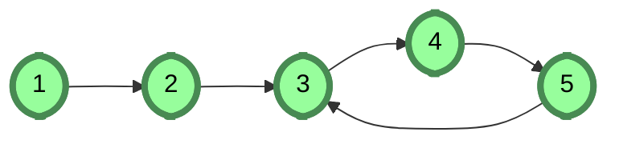
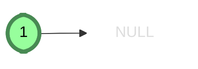
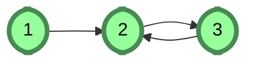

# [Linked Lists: Detect a Cycle](https://www.hackerrank.com/challenges/ctci-linked-list-cycle)

- Difficulty:  `#easy`
- Category: `#ProblemSolvingIntermediate` `#linkedlists`

A linked list is said to contain a cycle if any node is visited more
than once while traversing the list.
For example, in the following graph there is a cycle formed
when node `5` points back to node `3`.



## Function Description

Complete the function has_cycle in the editor below.
It must return a boolean true if the graph contains a cycle, or false.

has_cycle has the following parameter(s):

- head: a pointer to a Node object that points to the head of a linked list.

## Returns

- boolean: True if there is a cycle, False if there is not

**Note**: If the list is empty, `head` will be null.

## Input Format

There is no input for this challenge.
A random linked list is generated at runtime and passed to your function.

## Constraints

- $ 0 \leq \text{list size} \leq 100$

## Sample Input

The following linked lists are passed as arguments to your function:





## Sample Output

```text
0
1
```

## Explanation

1. The first list has no cycle, so we return false and the
hidden code checker prints 0 to stdout.
2. The second list has a cycle, so we return true and the
hidden code checker prints 1 to stdout.
