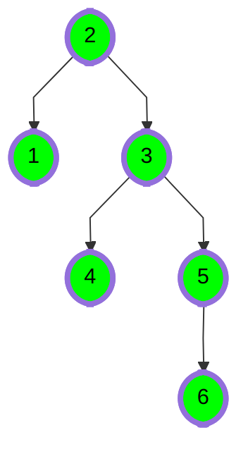

# [Binary Search Tree: Lowest Common Ancestor](https://www.hackerrank.com/challenges/binary-search-tree-lowest-common-ancestor)

- Difficulty:  `#easy`
- Category: `#ProblemSolvingAdvanced` `#trees`

You are given pointer to the root of the binary search tree and
two values `v1` and `v2`.
You need to return the lowest common ancestor ([LCA](https://en.wikipedia.org/wiki/Lowest_common_ancestor))
of `v1` and `v2` in the binary search tree.



In the diagram above, the lowest common ancestor
of the nodes `4` and `6` is the node `3`.
Node `3` is the lowest node which has nodes  and  as descendants.

## Function Description

Complete the function lca in the editor below.
It should return a pointer to the lowest common ancestor node of the two values given.

lca has the following parameters:

- `root`: a pointer to the root node of a binary search tree
- `v1`: a node.data value
- `v2`: a node.data value

## Input Format

The first line contains an integer, `n`, the number of nodes in the tree.

The second line contains `n` space-separated integers representing `node.data` values.

The third line contains two space-separated integers, `v1` and `v2`.

To use the test data, you will have to create the binary search tree yourself.
Here on the platform, the tree will be created for you.

## Constraints

- $ 1 \leq n, node.data \leq 25 $
- $ 1 \leq v1, v2 \leq 25 $
- $ v1 \not = v2 $

The tree will contain nodes with data equal to `v1` and `v`2.

## Output Format

Return the a pointer to the node that is the lowest common ancestor of  and .

## Sample Input

```text
6
4 2 3 1 7 6
1 7
```


`v1 = 1` and `v2 = 7`.

## Sample Output

[reference to node 4]

## Explanation

LCA of `1` and `7` is `4`, the root in this case.
Return a pointer to the node.
