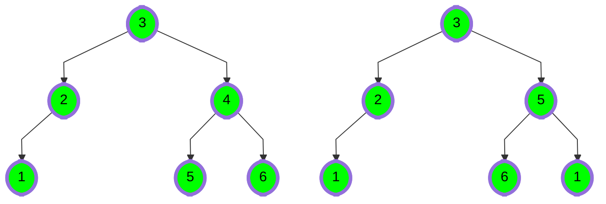
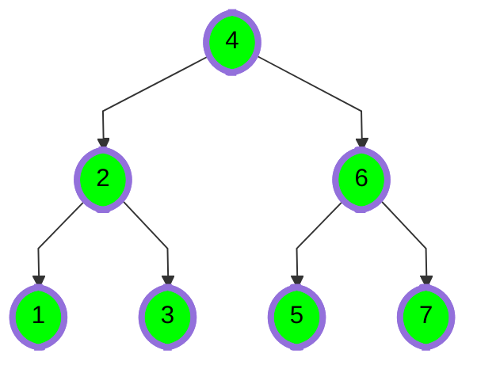

# [Trees: Is This a Binary Search Tree?](https://www.hackerrank.com/challenges/ctci-is-binary-search-tree)

- Difficulty:  `#medium`
- Category: `#ProblemSolvingAdvanced` `#trees`

For the purposes of this challenge,
we define a binary search tree to be a binary tree with the following properties:

- The `data` value of every node in a node's left subtree
    is less than the data value of that node.
- The `data` value of every node in a node's right subtree
    is greater than the data value of that node.
- The `data` value of every node is distinct.

For example, the image on the left below is a valid BST.
The one on the right fails on several counts:

- All of the numbers on the right branch from the root are not larger than the root.
- All of the numbers on the right branch from node 5 are not larger than 5.
- All of the numbers on the left branch from node 5 are not smaller than 5.
- The data value 1 is repeated.



Given the root node of a binary tree, determine if it is a binary search tree.

## Function Description

Complete the function checkBST in the editor below.
It must return a boolean denoting whether or not the binary tree
is a binary search tree.

checkBST has the following parameter(s):

- `root`: a reference to the root node of a tree to test

## Input Format

You are not responsible for reading any input from stdin.
Hidden code stubs will assemble a binary tree and pass its root node to your
function as an argument.

## Constraints

- $ 0 \leq data \leq 10^4 $

## Output Format

Your function must return a boolean true if the tree is a binary search tree.
Otherwise, it must return false.

## Sample Input



## Sample Output

```text
Yes
```

## Explanation

The tree in the diagram satisfies the ordering property for a Binary Search Tree,
so we print Yes.
