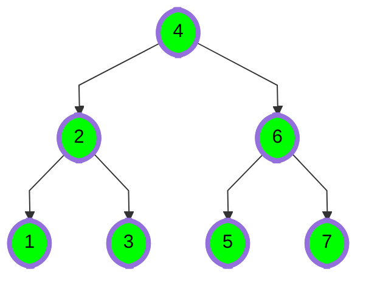
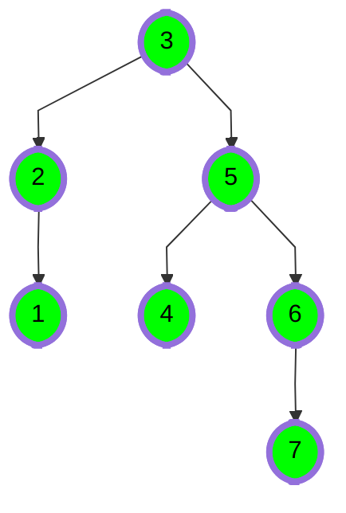
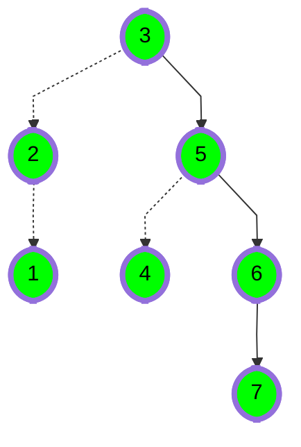

# [Tree: Height of a Binary Tree](https://www.hackerrank.com/challenges/tree-height-of-a-binary-tree)

- Difficulty:  `#easy`
- Category: `#ProblemSolvingAdvanced`

The height of a binary tree is the number of
edges between the tree's root and its furthest leaf.
For example, the following binary tree is of height `2`:



## Function Description

Complete the getHeight or height function in the editor.
It must return the height of a binary tree as an integer.

getHeight or height has the following parameter(s):

- root: a reference to the root of a binary tree.

**Note** -The Height of binary tree with single node is taken as zero.

## Input Format

The first line contains an integer `n`, the number of nodes in the tree.
Next line contains `n` space separated integer where `i`th integer denotes `node[i].data`.

**Note**: Node values are inserted into a binary search tree before a
reference to the tree's root node is passed to your function.
In a binary search tree, all nodes on the left branch of a node
are less than the node value.
All values on the right branch are greater than the node value.

## Constraints

- $ 1 \leq node.data[i] leq 20 $
- $ 1 \leq n leq 20 $

## Output Format

Your function should return a single integer denoting the height of the binary tree.

## Sample Input



## Sample Output

```text
3
```

## Explanation

The longest root-to-leaf path is shown below:



There are `4` nodes in this path that are connected by `3` edges,
meaning our binary tree's `height = 3`.
